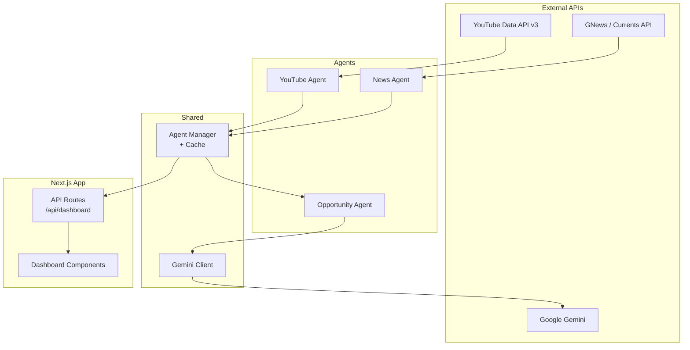

# AI Content Opportunity Dashboard

An AI-powered dashboard that analyzes trending YouTube videos and latest news articles to discover untapped content opportunities using a multi-agent AI architecture powered by Google Gemini.

## Overview

The dashboard fetches real-time data from YouTube and news APIs, then uses Google Gemini to analyze gaps between what's trending and what's being covered — surfacing actionable content opportunities for creators.

## Features

- **Multi-Agent AI Architecture** — Specialized agents for YouTube, News, and Opportunity analysis coordinated by a central Agent Manager.
- **YouTube Trend Analysis** — Fetches the most popular videos from YouTube India with view counts, categories, and metadata.
- **News Aggregation** — Pulls latest headlines from GNews (with Currents API as primary provider when configured), including source attribution and images.
- **AI Content Opportunity Generation** — Google Gemini compares trending videos against breaking news to discover underrepresented topics with high potential.
- **Dashboard Visualization** — Clean, responsive dark-themed UI built with Next.js, Tailwind CSS, and shadcn components.
- **In-Memory Caching** — 5-minute cache reduces API calls and improves response times.
- **Graceful Degradation** — Individual agent failures produce empty sections, not crashes.
- **Retry Logic** — Exponential backoff with 429 rate-limit awareness on all external API calls.

## Architecture



### Data Flow

1. **Dashboard** calls `/api/dashboard` (GET for cached, POST for force-refresh).
2. **Agent Manager** checks its in-memory cache (5-min TTL). On cache miss:
   - Runs **YouTube Agent** and **News Agent** in parallel.
   - Passes both reports to the **Opportunity Agent**.
3. **Opportunity Agent** constructs a prompt and sends it to **Gemini**, which returns AI-generated content opportunities.
4. The combined result is cached and returned to the dashboard.

## Tech Stack

| Category | Technology |
|---|---|
| Framework | Next.js 16 (App Router) |
| Language | TypeScript 5 |
| UI | React 19, Tailwind CSS 4, shadcn |
| AI | Google Gemini (`@google/genai`) |
| HTTP | Axios |
| Icons | Lucide React |
| Styling | CSS Variables, oklch colors, glassmorphism |

## Getting Started

### Prerequisites

- Node.js 18+
- npm 9+
- API keys for YouTube Data API v3, GNews, and Google Gemini

### Installation

```bash
# Clone the repository
git clone <repository-url>
cd ai-content-agent

# Install dependencies
npm install
```

### Environment Variables

Copy the example file and fill in your API keys:

```bash
cp .env.example .env.local
```

Required variables:

| Variable | Description |
|---|---|
| `GEMINI_API_KEY` | Google Gemini API key |
| `YOUTUBE_API_KEY` | YouTube Data API v3 key |
| `GNEWS_API_KEY` | GNews API key |
| `CURRENTS_API_KEY` | *(Optional)* Currents API key — used as primary news source |

### Development

```bash
npm run dev
```

Open [http://localhost:3000](http://localhost:3000) to view the dashboard.

### Available Scripts

| Script | Description |
|---|---|
| `npm run dev` | Start development server |
| `npm run build` | Create production build |
| `npm run start` | Start production server |
| `npm run lint` | Run ESLint |
| `npm run typecheck` | Run TypeScript type checking |

## Project Structure

```
ai-content-agent/
├── agents/
│   ├── news/
│   │   ├── agent.ts          # News agent — orchestrates news fetching
│   │   └── tool.ts           # Currents/GNews API integration
│   ├── opportunity/
│   │   ├── agent.ts          # Opportunity agent — Gemini integration
│   │   └── prompt.ts         # AI prompt construction
│   ├── shared/
│   │   ├── gemini.ts         # Gemini client (lazy-initialized)
│   │   └── manager.ts        # Agent Manager with caching
│   └── youtube/
│       ├── agent.ts          # YouTube agent — orchestrates video fetching
│       └── tool.ts           # YouTube Data API integration
├── app/
│   ├── api/
│   │   ├── dashboard/route.ts
│   │   ├── news/route.ts
│   │   ├── opportunity/route.ts
│   │   └── youtube/route.ts
│   ├── globals.css
│   ├── layout.tsx
│   └── page.tsx
├── components/
│   ├── dashboard/
│   │   ├── Dashboard.tsx     # Main dashboard container
│   │   ├── Error.tsx         # Error state with retry
│   │   ├── Header.tsx        # Dashboard header with refresh
│   │   ├── Loading.tsx       # Skeleton loading state
│   │   ├── NewsCard.tsx      # News articles grid
│   │   ├── OpportunityCard.tsx # AI opportunities grid
│   │   ├── Stats.tsx         # Statistics cards
│   │   └── YoutubeCard.tsx   # YouTube videos grid
│   └── ui/                   # shadcn base components
├── lib/
│   ├── api.ts                # Client-side dashboard API
│   └── utils.ts              # Formatting utilities
├── types/
│   └── index.ts              # Shared TypeScript interfaces
└── package.json
```

## API Routes

| Route | Method | Description |
|---|---|---|
| `/api/dashboard` | GET | Fetch dashboard data (cached) |
| `/api/dashboard` | POST | Force-refresh dashboard data |
| `/api/youtube` | GET | Fetch YouTube trending videos |
| `/api/news` | GET | Fetch latest news articles |
| `/api/opportunity` | GET | Fetch AI-generated opportunities |

All routes return consistent JSON:

```json
{
  "success": true,
  "data": { ... }
}
```

On error:

```json
{
  "success": false,
  "data": null,
  "error": "A user-friendly message"
}
```

## Error Handling

- **External API failures** are caught per-agent with safe empty-array fallbacks.
- **Gemini failures** return an empty opportunities list rather than crashing.
- **Rate limits (429)** trigger exponential backoff with longer delays.
- **Timeouts** are enforced on all external requests (10s for APIs, 30s for Gemini).
- **Client errors** are sanitized — no stack traces or internal paths are exposed.

## License

This project is private.
